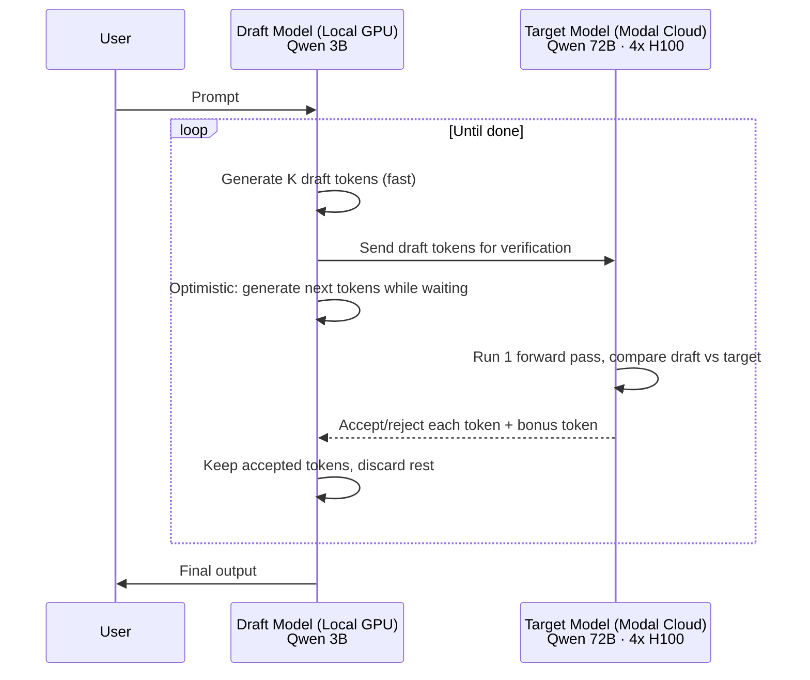

# Architecture

```mermaid
sequenceDiagram
    participant U as User
    participant D as Draft Model (Local GPU)<br/>Qwen 3B
    participant T as Target Model (Modal Cloud)<br/>Qwen 72B · 4x H100

    U->>D: Prompt

    loop Until done
        D->>D: Generate K draft tokens (fast)
        D->>T: Send draft tokens for verification
        D->>D: Optimistic: generate next tokens while waiting
        T->>T: Run 1 forward pass, compare draft vs target
        T-->>D: Accept/reject each token + bonus token
        D->>D: Keep accepted tokens, discard rest
    end

    D->>U: Final output
```
